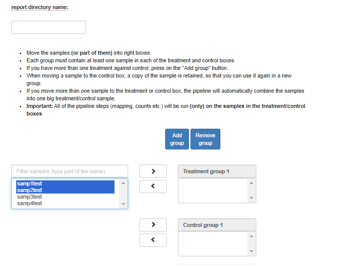
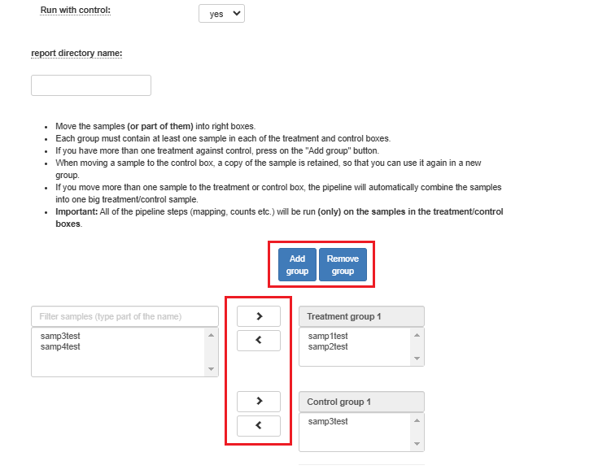

ChIP-Seq pipeline
-----------------
The ChIP-seq (Chromatin Immuno-Precipitation followed by Sequencing) pipeline facilitates the analysis of ChIP-seq data in order to identify genome-wide DNA binding sites for transcription factors and other proteins. 
The pipeline receives single or paired-end reads as input (the type of input is automatically determined by the number of fastq files generated per sample), performs quality control and pre-processing steps, and maps the reads onto mouse or human genomes. 
Peak analysis is then performed (after some post-processing), on the identified DNA binding fragments, and significant peaks (as compared to a control background if present) are selected and analyzed.

ChIP-Seq Analysis Setup
=======================

 .. image:: ../../figures/chip-seq.png

ATAC-Seq pipeline
-----------------
The ATAC-Seq (Assay for transposase-accessible chromatin using sequencing) pipeline facilitates the analysis of ATAC-Seq data in order to capture open and accessible regions of chromatin across the genome. 
The pipeline receives paired-end reads as input, performs quality control and pre-processing steps, and maps the reads onto mouse or human genomes. Nucleosome-free fragments are selected, peaks (as compared to a control background if present) are identified  and analyzed.

ATAC-Seq Analysis Setup
=======================

 .. image:: ../../figures/atac-seq.png

------------

In the input folder field, Browse within your directory structure and use the Select button the **root folder**  for analysis.  Note that if you wish to go up one level (or more) click on the desired folder level using the path at the top of the window.

.. image:: ../figures/browse-folder.png

Input folder names must conform to the correct format as previously described. If there is a problem with the folder you selected, first resolve the error and then retry, selecting the updated folder.

If you wish the output folder to be different from the one automatically filled in (based on the selected input folder), just select the desired output folder.

Fill in the project name, then select the genome and annotation. The Chromosome Info and Blacklist fields will be automatically filled based on the selected genome.

------------

To compare control samples with treatment samples, select the Run with Control option. Enter your desired folder name for storing the analysis results and the final report. By default, two categories must be created: one for the control group and one for the treatment group. To define additional groups, click the Add Group button to enter their details.

Choose the samples by first selecting them, and then using the arrows to move them to the appropriate groups. You may also add additional groups.                                                                                                                              
                                                                                                                  

All of the steps of the pipeline (mapping, peak calling etc.) will be run on all of the samples.

Finally, click on the "Run analysis" button.

At the end of the run, an email will be sent reporting analysis completion.
