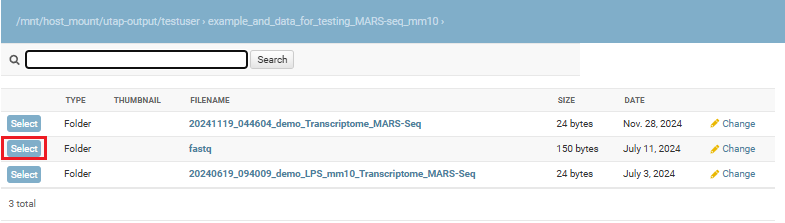

Run Transcriptome pipelines
################################

Analysis Setup
----------------------

If your pipeline is RNA-seq, you will get this screen:

If your pipeline is MARS-seq, you will get this screen:

.. image:: ../../figures/mars-seq.png

If your pipeline is DESeq2 from counts matrix, you will get this screen:

------------

**For the DESeq2 from Counts Matrix Pipeline:**

  1. In the Input File field, navigate through your directory structure and use the Select button to choose the file containing the counts matrix for analysis. The file must be in either CSV or TXT format.

  
  2. Fill in the Project Name.

  3. Select the Genomes for Functional Analysis.

**For RNA-Seq and MARS-Seq Pipelines:**

  1. In the Input Folder field, browse through your directory structure and use the Select button to choose the root folder for analysis.

  2. Fill in the Project Name.

  3. Select the Genome and Annotation.

  4. Define the type of adapters for each read (R1 and R2). The pipeline will remove these adapters from the reads. You can use the default adapters if your protocol is TrueSeq, which uses P5 and P7 adapters.

  5. For RNA-seq protocols:

      Indicate whether your protocol is stranded (preserves the original strand of RNA fragments) or non-stranded.

      Specify if your protocol is paired-end or single-end.

      Indicate whether you wish to correct for UMIs. If so, provide the correct UMI length.

**Note:** If you wish to navigate to a higher-level directory, click on the desired folder level in the path displayed at the top of the window, as illustrated in the image below.

The input name must conform to the correct format as previously described. If there is an issue with the input you selected, resolve the error first and then retry, selecting the updated input.

If you wish the Output Folder to be different from the default (automatically set based on the selected input folder), simply select the desired output folder.

------------

To identify what's differentially expressed by using the DESeq2 package, select the Run DESeq2 option. By default, two categories must be created. Fill in the category names for each of the 2 categories displayed by default. To define more categories, click on the Add Categories button to enable entering their details.

.. image:: ../../figures/deseq1.png

------------

Choose the samples by first selecting them, and then using the arrows to move them to the appropriate categories. You may also add additional categories.

.. image:: ../../figures/deseq2.png

------------

The order of what's being compared will be determined by the specification order of the categories. For example, DESeq2's output will show a "Treatment" vs "Control" comparison when "Treatment" is defined to be the first category, and "Control" the second.
Note that when submitting more than two categories, all categories will be compared with all the rest (e.g. for three categories - category 1 vs category 2, category 1 vs category 3, category 2 vs category 3).

If the samples were prepared in different batches, one can annotate them as follows: After moving the samples into category boxes, click on the "Add Batch Effect" button, select the samples from the category boxes that belong to a particular batch, and click on the "Batch 1" button. Repeat the operation for the other batches. Be sure that the batch effect is designed correctly - seeDESeq2 documentation `here  <https://bioconductor.org/packages/3.7/bioc/vignettes/DESeq2/inst/doc/DESeq2.html#model-matrix-not-full-rank>`_.

.. image:: ../../figures/deseq-batch.png

All of the steps of the pipeline (mapping, counts etc.) will be run on all of the samples, with the exception of DESeq2 which will be run only on samples with categories.

Finally, click on the "Run analysis" button.

At the end of the run, an email will be sent reporting analysis completion.

Using the pipeline efficiently
------------------------------

**If you want re-run only the DESeq2 step several times on the same input folder (with other comparisons/batches), after completion of the initial analysis you will see (on the "user dataset" screen) a new button called "run again with other parameters". Clicking on this button will re-run only the DESeq2 step.**

**Thus, the analysis will re-run only the short DESeq2 step (which takes a few minutes) and not re-run all of the time-consuming steps of the complete pipeline.**
