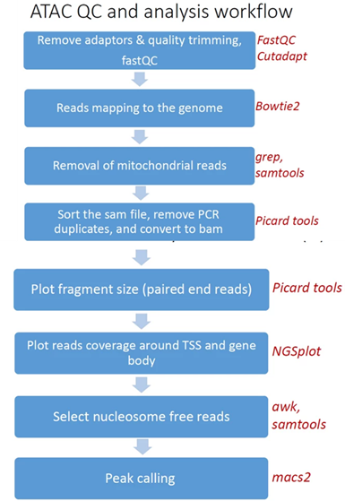

 Analysis pipeline steps and reports
###################################

Analysis pipeline steps
-----------------------

1. Reads trimming: Reads are quality trimmed using cutadapt (DOI: 14806/ej.17.1.200) (with the parameters --times 2 -q 20 -m 25). In this process primers corresponding to the TruSeq protocol are removed (output is in folder 1).

2. Quality control: Reads quality control is evaluated using FastQC (with the parameter --cassava). (in output folder 2), and a report file, containing quality reports for all of the samples, is generated using multiQC (in output folder 3).

3. Mapping to genomes: The quality trimmed reads are mapped to Mouse and Human genomes using Bowtie2 (doi: 10.1038/nmeth.1923.) (with the parameters --local for all analyses and, in addition, -X 2000 for paired end analyses). Refseq annotation is provided for the mapped genes.

4. Alignment filtering: Following the alignment, mitochondrial genes are removed from the analysis (using the grep command). 
   Reads are filtered using samtools view with the parameters -F 4 to remove unmapped reads that are output by bowtie2, and with -f 0x2 -q 39 for paired end reads. 
   Duplicated reads are removed using picard-tools. The remaining unique reads are indexed and sorted using samtools index and samtools sort. 
   Statistics on the alignment is generated using flagstat (output is in folder 5).  

5. Reads shifting: To account for the 9-bp duplication created by DNA repair of the nick by Tn5 transposase (as described by Buenrostro et al. 2013 PMID: 24097267), aligned reads are shifted + 4 bp and − 5 bp for positive and negative strand respectively, using using bedtools bamtobed and awk commands.

6. Select nucleosome-free fragments: fragments of length <120bp are selected using the awk command (alignments are in folder 6), and insert size distributions are plotted before and after size selection (output is in folder 8, plots after selection end with "_nucl_free").

7. Visualization in graphs: reads coverage on gene body and around the TSS are graphically visualized using ngsplot (output is in folder 7).

8. Read counts on TSS: for mm10 genome we count the number of reads on genes’ TSS (Transcription Start Site) regions based on, Nature. 2016 Jun 30;534(7609):652-7 ).

9. Peak calling: Broad peaks are called using MACS2 (output is in folder 11). The resulting peaks "*_peaks_filtered.broadPeak" are filtered to exclude peaks from the blacklist (https://github.com/Boyle-Lab/Blacklist/tree/master/lists).

10. Peak annotation: The predicted peaks are collected from all samples using multi_intersectBed and then annotated according to the corresponding genome using Homer (with default parameters). 
    Analysis of peaks distribution in genomic regions, and around TSS is done using ChIPseeker, together with a venn diagram of overlap of peaks sets.                                                                                                                                                                                 
                                                                                                      

                                                                                                    
Pipeline report
---------------

Upon completion of the analysis, you will be sent an email with links to the results report.

The report includes several sections:

1. Sequencing and Mapping QC

    a. `**Figure 1** <https://dors4.weizmann.ac.il/utap/figures/atac_fig_1.png>`_ - Plots the average quality of each base across all reads. Qualities of 30 (predicted error rate 1:1000) and above are good. 
    b. `**Figure 2** <https://dors4.weizmann.ac.il/utap/figures/atac_fig_2.png>`_ - Histogram showing the number of reads for each sample in the raw data.
    c. **Figure 3** - Histogram showing the percentage of reads discarded after trimming the adapters (after removing adapters, short, polyA/T and low quality reads are discarded by the pipeline).
       No figure will be presented if the percentage of reads discarded after trimming for all samples is lower than 1%.
    d. `**Figure 4** <https://dors4.weizmann.ac.il/utap/figures/atac_fig_4.png>`_ - Histogram with the number of reads for each sample in each step of the pipeline.
    e. `**Figure 5** <https://dors4.weizmann.ac.il/utap/figures/atac_fig_5.png>`_ - Plots sequence coverage on and near gene regions.
    f. `**Figure 6** <https://dors4.weizmann.ac.il/utap/figures/atac_fig_6.png>`_ - Plots sequence coverage on and near TSS regions.
    g. `**Figure 7** <https://dors4.weizmann.ac.il/utap/figures/atac_fig_7.png>`_ - Histogram of the insert-size for each sample.

2. MACS peak calling
    a. `**Figure 8** <https://dors4.weizmann.ac.il/utap/figures/atac_fig_8.png>`_ - MACS (peak calling) results table for each sample or for each comparison, if the pipeline was run with a control.
    b. `**Figure 9** <https://dors4.weizmann.ac.il/utap/figures/atac_fig_9.png>`_ - Histogram with the number of peaks for all samples or for comparisons, if the pipeline was run with a control.
    c. `**Figure 10** <https://dors4.weizmann.ac.il/utap/figures/atac_fig_10.png>`_ - Histogram showing Peaks distribution in genomic regions.    
    d. `**Figure 11** <https://dors4.weizmann.ac.il/utap/figures/atac_fig_11.png>`_ - Histogram showing Peaks distribution around TSS.
    e. `**Figure 12** <https://dors4.weizmann.ac.il/utap/figures/atac_fig_12.png>`_ - Venn diagram of peak overlaps among the first four comparisons.
                                                                                                      
3. `Bioinformatics Pipeline Methods <https://dors4.weizmann.ac.il/utap/figures/atac_fig_13.png>`_ - description of pipeline methods

4. `Links to additional results <https://dors4.weizmann.ac.il/utap/figures/atac_fig_14.png>`_ - links for downloading tables with raw, normalized counts, log normalized values (rld), and statistical data of contrasts.
                                                                                                   
--------------- 
                                                                                                      
                                                                                                      
Output folders:
---------------                                                                                                      
                                                                                                      
1_cutadapt

2_fastqc

3_multiqc

4_mapping

5_process_alignment

6_nucleosome_free

7_shift_bam

8_ngs_plot

9_picard_plot

10_tss_count

11_call_peak

12_peaks_annotation

13_reports

Log files (one directory above the output directory):

snakemake_stdout.txt

Add label

                                                                                                      
Annotation file
---------------

For Peak annotation, we use annotation files (gtf format) from "Ensembl" or "GENCODE". 
                                                                                                      
                                                                                                      

Examples of reports
-------------------

`ATAC-Seq example <https://utap-demo.weizmann.ac.il/reports/20241119_044729_demo/report_Chromatin_pipelines.html>`_

