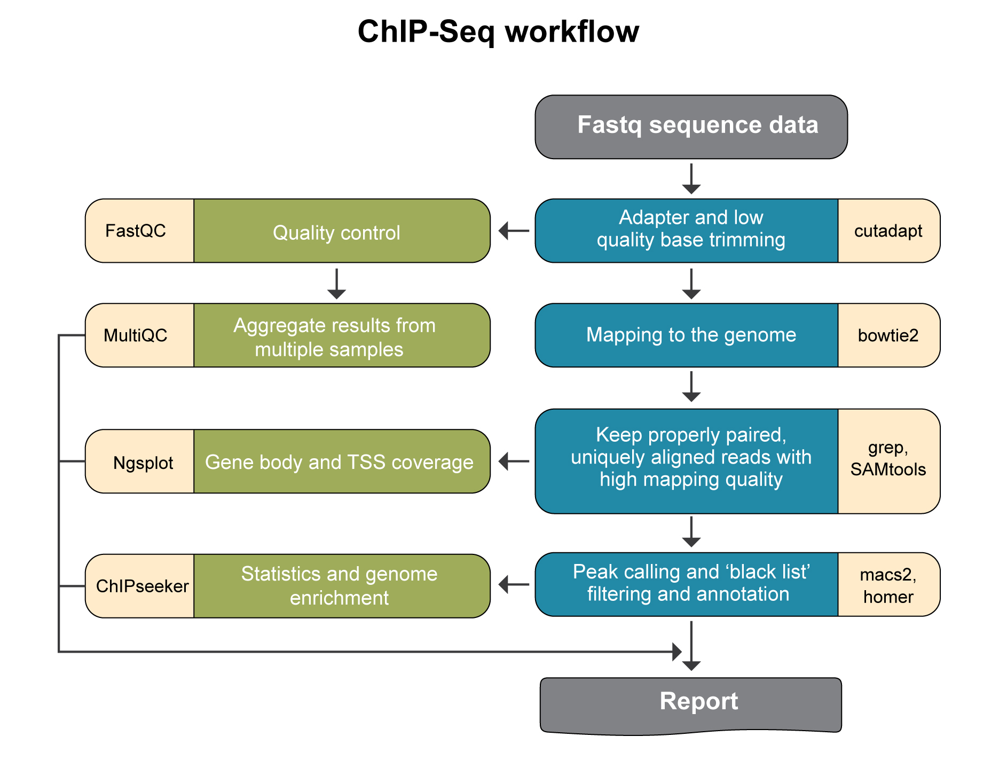

ChIP-seq pipeline steps and reports
###################################

Analysis pipeline steps
-----------------------

1. Reads trimming: Reads are trimmed using cutadapt (DOI: 14806/ej.17.1.200) (with the parameters --times 2 -q 20 -m 25). In this process, primers corresponding to the Tru-seq protocol are removed.

2. Quality control: Reads quality control is evaluated using FastQC (with the parameter --cassava). A report file, containing quality results for all of the samples is generated using multiQC.
  
3. Mapping to genomes: The quality trimmed reads are mapped to Mouse and Human genomes using Bowtie2 (doi: 10.1038/nmeth.1923.) (with the parameters --local for all analyses and, in addition, -X 2000 for paired end analyses). Refseq annotation is provided for the mapped genes.

4. Alignment filtering: Following the alignment, reads are filtered using samtools view with the parameters -F 4 to remove unmapped reads that are output by bowtie2, -q 39 and with -f 0x2 for paired end reads. 
   The remaining unique reads are then indexed and sorted, using samtools index and samtools sort.

5. Generation of statistics on the alignment using flagstat.

6. Visualization in graphs: The reads are graphically visualized using ngsplot (with the parameters -G -R genebody -C -O samples -D refseq -L 50000).

7. Peak calling: Significant chip regions (peaks) are evaluated and compared to control samples if present using macs2 callpeak (with the parameters --bw 300 -B -f --SPMR -g -keep-dup auto -q 0.01 for all analyses, BAMPE --nomodel for paired end analyses, and BAM for single end analyses). 
   The resulting peaks "*_peaks_filtered.broadPeak" are filtered to exclude peaks from the blacklist (https://github.com/Boyle-Lab/Blacklist/tree/master/lists).

8. Conversion to BigWig format: Files containing the predicted peaks coordinates in BedGraph format are converted to BigWig format using bedtools slop (with the parameters -g -b 0), bedClip stdin and bedGraphToBigWig (with default parameters).

9. Peak annotation: The predicted peaks are collected from all samples using multiIntersectBed and then annotated according to the corresponding genome using Homer (with default parameters). 
   Analysis of peaks distribution in genomic regions, and around TSS is done using ChipSeeker, together with a Venn diagram of overlap of peaks sets.

                                                                                                      

                                                                                                      A
Pipeline report
---------------

Upon completion of the analysis, you will be sent an email with links to the results report.

The report includes several sections:

1. Sequencing and Mapping QC

    a. `Figure 1 <https://dors4.weizmann.ac.il/utap/figures/chip_fig_1.png>`_ - Plots the average quality of each base across all reads. Qualities of 30 (predicted error rate 1:1000) and above are good. 
    b. `Figure 2 <https://dors4.weizmann.ac.il/utap/figures/chip_fig_2.png>`_ - Histogram showing the number of reads for each sample in the raw data.
    c. Figure 3 - Histogram showing the percentage of reads discarded after trimming the adapters (after removing adapters, short, polyA/T and low quality reads are discarded by the pipeline).
       No figure will be presented if the percentage of reads discarded after trimming for all samples is lower than 1%.
    d. `Figure 4 <https://dors4.weizmann.ac.il/utap/figures/chip_fig_4.png>`_ - Histogram with the number of reads for each sample in each step of the pipeline.
    e. `Figure 5 <https://dors4.weizmann.ac.il/utap/figures/chip_fig_5.png>`_ - Plots sequence coverage on and near gene regions. 

2. MACS peak calling
    a. `Figure 6 <https://dors4.weizmann.ac.il/utap/figures/chip_fig_6.png>`_ - MACS (peak calling) results table for each sample or for each comparison, if the pipeline was run with a control.
    b. `Figure 7 <https://dors4.weizmann.ac.il/utap/figures/chip_fig_7.png>`_ - Histogram with the number of peaks for all samples or for comparisons, if the pipeline was run with a control.
    c. `Figure 8 <https://dors4.weizmann.ac.il/utap/figures/chip_fig_8.png>`_ - Histogram showing Peaks distribution in genomic regions.    
    d. `Figure 9 <https://dors4.weizmann.ac.il/utap/figures/chip_fig_9.png>`_ - Histogram showing Peaks distribution around TSS.
    e. `Figure 10 <https://dors4.weizmann.ac.il/utap/figures/chip_fig_10.png>`_ - Venn diagram of peak overlaps among the first four comparisons.
                                                                                                      
3. `Bioinformatics Pipeline Methods <https://dors4.weizmann.ac.il/utap/figures/chip_fig_12.png>`_ - Description of pipeline methods.

4. `Links to additional results <https://dors4.weizmann.ac.il/utap/figures/chip_fig_13.png>`_ - Links for downloading tables with raw, normalized counts, log normalized values (rld), and statistical data of contrasts.
                                                                                                   
--------------- 
                                                                                                      
                                                                                                      
Output folders
---------------                                                                                                      
                                                                                                      
0_concatenating_fastq

1_cutadapt

2_fastqc

3_multiQC

4_mapping

5_filtered_alignment

6_peaks_prediction

7_peaks_annotation

8_graphs

9_BigWig

10_reports

Log directory

                                                                                                      
Annotation file
---------------

For Peak annotation, we use annotation files (gtf format) from "Ensembl" or "GENCODE". 
                                                                                                      
                                                                                                      

Examples of reports
-------------------

`ChIP-Seq example <https://utap-demo.weizmann.ac.il/reports/20241119_044920_demo/report_Chromatin_pipelines.html>`_

