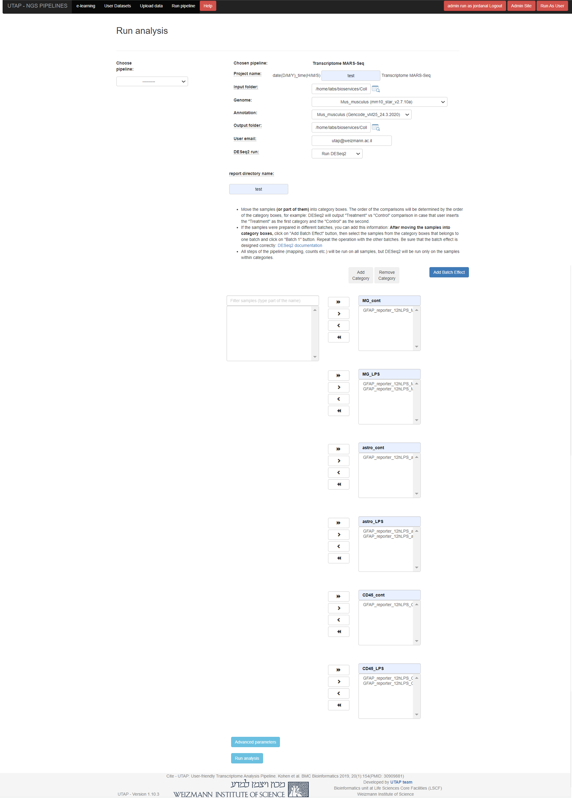

Installation
############

*Support:* utap@weizmann.ac.il

Requirements
============

The application should be installed on a Linux server.

If the server supports LSF or PBS cluster, it is recommended to run UTAP pipelines on the cluster in order to improve computational efficiency. Otherwise, if the server does not support LSF cluster, the UTAP pipelines will need to be executed locally.

The host server and/or each compute node in the relevant queue(s) requires ~40GB of RAM memory.

The server requires the following:
SingularityCE version > 3.10.4  

For downloading SingularityCE refer to: https://sylabs.io/singularity/

The “USER” (see optional_parameters.conf file below) must have full permissions to "HOST_MOUNT" folder (see required_parameters.conf file below) and to singularity commands.
If the application is run on cluster, the user is also required to have permissions to run cluster commands.

UTAP can be installed either as an instance container or as a sandbox container. 
If the "USER" has "Fakeroot" privileges and there is approximately 36 GB of available space in the server's temp directory (default location: /tmp, but can be modified using SINGULARITY_TMP_DIR in the optional_parameters.conf file below) or in the "HOST_MOUNT" directory, and the corresponding directory is not mounted as a GPFS or NFS mount, then UTAP will be installed as an instance container. Otherwise, UTAP will be installed as a sandbox container.

The "USER" should then do the following:

Run UTAP
========

Create a directory for UTAP software and its output
---------------------------------------------------

Note: Since user output data will be written in this folder, please verify that you have sufficient disk space -  approximately 400G per analysis.
::

   HOST_MOUNT=<the relevant path>
   mkdir $HOST_MOUNT
   cd $HOST_MOUNT

Download the UTAP installation folder 
-------------------------------------

The UTAP installation folder includes the following files:
  a.	install_UTAP_singularity.sh
  b.	optional_parameters.conf
  c.	ports.conf
  d.	required_parameters.conf
  e.	Singularity_sed.def
  f.	update-db.sh
  g.	install_UTAP_image.sh
  h.	run_UTAP_sandbox.sh

 You can download it using your browser or via ftp as noted below, and then unpack it in the $HOST_MOUNT folder.
::

   #Download the zipped folder into $HOST_MOUNT folder:
   wget ftp://dors.weizmann.ac.il/UTAP/UTAP_installation_files/UTAP_installation_files.tar.gz -P $HOST_MOUNT
   
   cd $HOST_MOUNT
   tar -xvzf UTAP_installation_files.tar.gz && mv UTAP_installation_files/* $HOST_MOUNT

Download genomes indexes
-------------------------

The genomes folder includes human (hg38), mouse(mm10) and zebrafish(danRer11) genomes indexes, you can choose to download only one of them as noted below.
If you require a genome that is not supplied,  follow the instruction in the section “Generate new genome index and annotation file”.

You can download the genomes folder using your browser or via ftp as noted below, and then unpack it in the $HOST_MOUNT under genomes directoy. If you chose to download the genomes in a diffrent location,you have to overwrite the parameter GENOMES_DIR in the optional_prameters.conf file.

In any case, if you are using multiple genomes, ensure that they are synchronized under the same directory using the rsync command as indicated below. 
::

    #Download the zipped folder into $HOST_MOUNT folder:
    #For Zebrafish genome:
    wget ftp://dors.weizmann.ac.il/UTAP/UTAP_genomes/Zebrafish.tar.gz
    tar -xvzf Zebrafish.tar.gz
    rsync -a Zebrafish/* genomes/
    
    #For Mouse genome:
    wget ftp://dors.weizmann.ac.il/UTAP/UTAP_genomes/Mouse.tar.gz
    tar -xvzf Mouse.tar.gz
    rsync -a Mouse/* genomes/
    
    #For Human genome:
    wget ftp://dors.weizmann.ac.il/UTAP/UTAP_genomes/Human.tar.gz
    tar -xvzf Human.tar.gz
    rsync -a Human/* genomes/
    

Pull UTAP image from the public repository
------------------------------------------
::

   singularity pull library://utap2/utap/utap:latest

Execute UTAP
--------------
Fill up all the parameters in files required_parameters.conf and optional_parameters.conf. 

All the parameters in the file required_parameters.conf are mandatory.
The parameters in the file optional_parameters.conf are not mandatory (can be left untouched) and are used to overwrite the existing default parameters in the file. 

All the parameters are described bellow under the section parameters.

For running UTAP run the command in the shell:

::

    cd $HOST_MOUNT
    ./install_UTAP_singularity.sh -a required_parameters.conf -b optional_parameters.conf
    

If UTAP was installed as instance, an image named utap.SIF (~7GB) will be generated in your $HOST_MOUNT directory with additonal folders and files required for UTAP run.
If UTAP was instaled as sandbox, a folder named utap.sandbox (~17GB) will be generated in your $HOST_MOUNT directory with additonal folders and files required for UTAP run.
After the run, you will be able to aceess the application on your browser using the address: 
http://DNS_HOST:HOST_APACHE_PORT or http://host_ip:7000 if the default values for DNS_HOST and HOST_APACHE_PORT were not changed.

Important:

A file called db.sqlite3 will be created within $DB_PATH folder.

The db.sqlite3 file is the database of the application; it contains user details, and links to results in the $HOST_MOUNT folder.

The $HOST_MOUNT folder contains all of the data for all of the users (input and output files).

The db.sqlite3 database and $HOST_MOUNT folder are located on the host server and not inside the container. 

Therefore, even if you stop/delete the "utap" container, the database and $HOST_MOUNT folder are not deleted.

If there is a need to temporarily delete singularity, keep the database ("db.sqlite3") and the same $HOST_MOUNT folder. 

When you rerun singularity via the install_UTAP_singularity.sh script,the existing database ("db.sqlite3") and $HOST_MOUNT folder will be used.

Test UTAP
=========

Run MARS-Seq pipeline with example data
--------------------------------------
For testing UTAP, You can download fastq files and test files for MARS-Seq pipeline folder using your browser or via ftp as noted below.
::

    cd $HOST_MOUNT
    wget ftp://dors.weizmann.ac.il/UTAP/UTAP_test_and_example_data/example_and_data_for_testing_mm10_MARS-seq/ $HOST_MOUNT/utap-output/admin/
    
Once the download is finished, log in to the UTAP site as the admin USER and select the Transcriptome MARS-Seq pipeline from the "Choose pipeline" scroll-bar. Proceed to complete the form according to the instructions provided below.

   1.Select the folder $HOST_MOUNT/utap-output/admin/example_and_data_for_testing_mm10_MARS-seq/fastq using the browser in the "Input folder" field.
   2.Select "Run DESeq2: in "DESeq2 run" choise field
   3.fill in the DESeq2 category boxes as follow:

   MG_cont
               GFAP_reporter_12hLPS_MG3_cont_1

   MG_LPS
               GFAP_reporter_12hLPS_MG1_LPS_1
               
               
               GFAP_reporter_12hLPS_MG2_LPS_2

   astro_cont
               GFAP_reporter_12hLPS_astro3_cont_1

   astro_LPS
               GFAP_reporter_12hLPS_astro1_LPS_1
               
               
               GFAP_reporter_12hLPS_astro2_LPS_2

   CD45_cont
               GFAP_reporter_12hLPS_CD45_3_cont_1

   CD45_LPS
               GFAP_reporter_12hLPS_CD45_1_LPS_1
               
               
               GFAP_reporter_12hLPS_CD45_2_LPS_2

It is crucial to ensure that all category names are identical to the names mentioned above. This is of utmost importance for verifying the successful completion of the UTAP run test.

Here is a screen shot of the MARS-Seq pipeline form for the example data.

4.click on "Run analysis" button

View pipeline output
-------------------
After submitting the run, you will be directed to the "User Datasets" page, which can also be accessed by navigating to "User_Datasets" in the site navigation bar. This page allows you to track the progress of all the runs. Within a few seconds of starting the run, a folder named $HOST_MOUNT/utap-output/admin/<run_id>_<run_name>_Transcriptome_MARS-Seq will be generated. This folder contains the pipeline output for each step, organized in separate folders.

The folder "10_reports/<report_name>_umi_counts_<run_id>" contains graphs, statistics, and additional information for all the pipeline steps. Once the run is completed, you will receive an email with links to the results report. For a detailed interactive explanation of the report, you can utilize the relevant e-learning module available in the site navigation bar.

An example of the pipeline output can be found at:
ftp://dors.weizmann.ac.il/UTAP/UTAP_test_and_example_data/example_and_data_for_testing_mm10_MARS-seq/20230520_231819_test_Transcriptome_MARS-Seq

For further details, please refer to the "Help" tab in the site navigation bar.

Check pipeline output
--------------------------
After the run is finished, you can verify the successful completion of the test run by executing the script test_UTAP.sh. This script compares the results from your pipeline with the example results available at ftp://dors.weizmann.ac.il/UTAP/UTAP_test_and_example_data/example_and_data_for_testing_mm10_MARS-seq/20230520_231819_test_Transcriptome_MARS-Seq.

To run the script, follow the instructions below:

::

    cd $HOST_MOUNT
    ./utap-output/admin/exmaple_and_data_for_testing_mm10_MARS-seq/test_files/test_UTAP.sh
    
If the run is successfully completed, the output message "UTAP test run succeeded" will be displayed. In case any issues arise during the run or testing process, please contact us for further assistance.

Parameters
==========

Required parameters
-------------------

HOST_MOUNT             
                       Mount point from the singularity on the host (full path of the folder).
                          
                       This is the folder that contains all UTAP installation files,
                          
                       All input and output data for all of the users will be written into this folder.

ADMIN_PASS              
                       Password of an admin in the UTAP database
                        
                       (The password must contain at least one uppercase character, one lowercase character, and one digit).

REPLY_EMAIL            
                       Support email for users. Users recieve emails from this adress.
                       If you provide a Gmail address, please ensure that you input your correct Gmail app password in the field "MAIL_PASSWORD" within the            optional_parameters.conf file. Refer to https://support.google.com/accounts/answer/185833?hl=en for getting gmail app password.
                      

MAX_CORES               
                       Maximum cores in the host computer or in each node of the cluster.

MAX_MEMORY                                      
                       Maximum memory in MB in the host computer or in each node of the cluster .

Optional parameters
-------------------                        
                        
                        
                        
USER                   
                       User in host server that has permission to run cluster commands (if run with cluster), run singularity commands and write 

                       into the $HOST_MOUNT folder (user can have fakeroot permissions).

                       **The default is:** USER=$USER

DNS_HOST               
                       DNS address of the host server.

                       For example: http://servername.ac.il or servername.ac.il
                        
                       The default is the IPv4 address of the host server (can be obtained with the command 'hostname -I')

MAIL_SERVER            
                       Domain name of the mail server.

                       **For example:** mg.weizmann.ac.il
                        
                       **The default is:**  REPLY_EMAIL= None

MAIL_PASSWORD
                       Password associated to the REPLY_EMAIL adress in required_parameters.conf file.
                        
                       **The default is:**  MAIL_PASSWORD=None

HOST_APACHE_PORT        
                        Any available port on the host server for the singularity Apache.

                        **For example:** 8080
                        
                        **The default is:** HOST_APACHE_PORT= 7000

INSTITUTE_NAME           
                        Your institute name or lab

                        (the string can contain only A-Za-z0-9 characters without whitespaces).

                        **The default is:** INSTITUTE_NAME=None

MAX_UPLOAD_SIZE          
                        Maximum file/folder size that a user can upload at once (Megabytes).

                        **For example:** 314572800 (i.e. 300*1024*1024 = 314572800Mb = 300Gb)

                        **The default is:** MAX_UPLOAD_SIZE =314572800

CONDA                   
                        Full path to miniconda's env root folder.

                        A full miniconda3 env exist inside the container .

                        **For example:** /miniconda3

                        **The default is:** CONDA=None 
                        
                        When default parameter is used the environmet at /opt/miniconda3 inside the container will be used.

PROXY_URL            
                        UTAP's URL if you are using proxy server. 
                        default: DNS_HOST:HOST_APACHE_PORT

RUN_NGSPLOT           
                      Set to 1 if for running NGS-plot.

                      **The default is:** RUN_NGSPLOT=1

HOST_HOME_DIR        
                     The USER home directory on the host. 

                     **For example:** /home/username 

                     **The default is:** $HOME

DB_PATH              
                     Full path to the folder where the DB will be located.

                     $USER needs to have write permission for this folder.

                     The DB is very small, so it is will not create disk space problems.

                     **For example:** mkdir /utap-db; chown -R $USER/utap-db; 

                     **The default is:** DB_PATH=$HOST_MOUNT/UTAP_DB

GENOMES_DIR          
                     The full path to the genomes directory.

                     **The default is:** GENOMES_DIR =$HOST_MOUNT/genomes 

SINGULARITY_TMP_DIR           
                     Singularity uses a temporary directory to build the squashfs filesystem, and this temp space needs to be at least 36GB  

                     large to hold the entire resulting Singularity image.
 
                     If you use fakeroot privileges,  make sure that the tmp directory is local and not NFS or GPFS mounted disc.

                     **The default is:** SINGULARITY_TMP_DIR=/tmp

FAKEROOT                      
                     Set to 1 If USER has fakeroot privileges.

                     **The default is:** FAKEROOT=None

SINGULARITY_HOST_COMMAND           
                                   Singularity command on the host. 

                                   **for example:** if singularity is installed as module named Singularity on the host then the command will be :”ml                                       
                                   Singularity”

                                   **The default is:** SINGULARITY_HOST_COMMAND=None 

Additional optional parameters for installing on a cluster:

CLUSTER_TYPE         
                     Type of the cluster.

                     **For example:** lsf or pbs or local.

                     The commands will be sent to the cluster. Currently, UTAP supports LSF or PBS cluters.
                     
                     When "local" parameter is used , UTAP pipelines will be run on the local host inside the container.

                     **The default is:** CLUSTER_TYPE=local

CLUSTER_QUEUE           
                     Queue name in the cluster. $USER must have permissions to run on this queue. 
                     
                     **The default is:** CLUSTER_QUEUE=None
                        

SINGULARITY_CLUSTER_COMMAND         
                                    Singularity command on the cluster. 

                                    **For example:** if singularity is installed as module named Singularity on the cluster, then command will be :”ml                                           
                                    Singularity”

                                    **The default is:** SINGULARITY_CLUSTER_COMMAND=None 
                                    

REMARKS
-------

1. PBS cluster installation was prepared but not tested.

