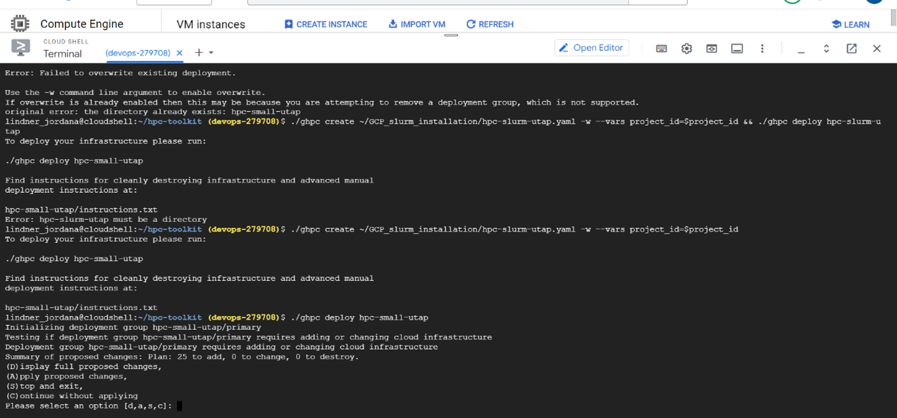

Installation
############

*Support:* utap@weizmann.ac.il

Requirements
============

The application should be installed on a Linux server.

If the server supports LSF cluster, it is recommended to run UTAP pipelines on the cluster in order to improve computational efficiency. Otherwise, if the server does not support LSF cluster, the UTAP pipelines will need to be executed locally.

The host server and/or each compute node in the relevant queue(s) requires ~40GB of RAM memory.

The server requires the following:
SingularityCE version > 3.10.4  

For downloading SingularityCE refer to: https://sylabs.io/singularity/

The user must have full permissions to singularity commands.
If the application is run on cluster, the user is also required to have permissions to run cluster commands.

The user should then do the following:

Run UTAP
========

Create a directory for UTAP software and its output
---------------------------------------------------

Note: Since user output data will be written in this folder, please verify that you have sufficient disk space -  approximately 400G per analysis.
::

   HOST_MOUNT=<the relevant path>
   mkdir $HOST_MOUNT
   cd $HOST_MOUNT

Download the UTAP installation folder 
-------------------------------------

The UTAP installation folder includes the following files:
  a.	install_UTAP_singularity.sh
  b.	optional_parameters.conf
  c.	ports.conf
  d.	required_parameters.conf
  e.	Singularity_sed.def
  f.	update-db.sh
  g.	install_UTAP_image.sh
  h.	run_UTAP_sandbox.sh

 You can download it using your browser or via ftp as noted below, and then unpack it in the $HOST_MOUNT folder.
::

   #Download the zipped folder into $HOST_MOUNT folder:
   wget ftp://dors.weizmann.ac.il/UTAP/UTAP_installation_files/UTAP_installation_files.tar.gz -P $HOST_MOUNT
   
   cd $HOST_MOUNT
   tar -xvzf UTAP_installation_files.tar.gz && mv UTAP_installation_files/* $HOST_MOUNT

Pull UTAP image from the public repository
------------------------------------------
::

   singularity pull library://utap2/utap/utap:latest

Download genomes indexes
-------------------------

The genomes folder contains indexes for human (hg38), mouse (mm10), and zebrafish (danRer11). You have the option to download any one of these genomes individually, as specified below. If you require a genome that is not provided, please refer to the instructions in the "Generate new genome index and annotation file" section.

You can download the genomes folder either through your browser or via FTP, as indicated below. After downloading, unpack the folder in the $HOST_MOUNT directory under the "genomes" folder. If you choose to download the genomes to a different location, you will need to overwrite the GENOMES_DIR parameter in the optional_parameters.conf file.

If you are using multiple genomes, it is important to ensure that they are synchronized under the same directory. You can achieve this by utilizing the "rsync" command as demonstrated below.
::

    #Download the zipped folder into $HOST_MOUNT folder:
    #For Zebrafish genome:
    wget ftp://dors.weizmann.ac.il/UTAP/UTAP_genomes/Zebrafish.tar.gz
    tar -xvzf Zebrafish.tar.gz
    rsync -a Zebrafish/* genomes/
    
    #For Mouse genome:
    wget ftp://dors.weizmann.ac.il/UTAP/UTAP_genomes/Mouse.tar.gz
    tar -xvzf Mouse.tar.gz
    rsync -a Mouse/* genomes/
    
    #For Human genome:
    wget ftp://dors.weizmann.ac.il/UTAP/UTAP_genomes/Human.tar.gz
    tar -xvzf Human.tar.gz
    rsync -a Human/* genomes/
   
   
   

Execute UTAP
--------------
Fill up all the parameters in files required_parameters.conf and optional_parameters.conf. 

The parameters listed in the required_parameters.conf file are all mandatory and must be provided.

The parameters mentioned in the optional_parameters.conf file are not mandatory and can be left unchanged. These optional parameters serve the purpose of overriding the default parameters already set in the file.

All the parameters are described below under the section parameters.

Note: UTAP can be installed either as an instance container or as a sandbox container. 
If the user has "fakeroot" privileges and there is approximately 36 GB of available space in the server's temp directory (default location: /tmp but can be modified using SINGULARITY_TMP_DIR in the optional_parameters.conf) or in the "HOST_MOUNT" directory, and the corresponding directory is not mounted as a GPFS or NFS mount, then UTAP will be installed as an instance container. Otherwise, UTAP will be installed as a sandbox container.

For running UTAP run the command in the shell:

::

    cd $HOST_MOUNT
    ./install_UTAP_singularity.sh -a required_parameters.conf -b optional_parameters.conf
    

If UTAP was installed as an instance, an image named utap.SIF (approximately 7GB in size) will be created in your $HOST_MOUNT directory, along with additional folders and files necessary for UTAP run.

Alternatively, if UTAP was installed as a sandbox, a folder named utap.sandbox (around 17GB in size) will be generated in your $HOST_MOUNT directory, containing the required folders and files for UTAP run.

Upon completion of the run, you will be able to access the application through your web browser using the following address:

http://DNS_HOST:HOST_APACHE_PORT
or
http://host_ip:7000
if the default values for DNS_HOST and HOST_APACHE_PORT were not modified.

Install UTAP on Google Cloud platform (GCP)
===========================================

Install Google cloud Slurm cluster VMs
--------------------------------------

requirments: 

google account
quoatas on network and vm  

1. Enter google cloud shell as described in the bellow image 

.. image:: ../figures/Google_shell.png

2. Clone scripts for installing Google cloud slurm cluster VMs:

::

   cd ~ && git clone --filter=blob:none --sparse  https://github.com/utap2/utap2.git --branch devel && cd utap2 && git sparse-checkout init && git sparse-checkout set GCP_installation_scripts
   chmod +X ~/utap2/GCP_installation_scripts/*
   bash ~/utap2/GCP_installation_scripts/install_GCP_slurm.sh -i "<project id>" -n "<project num>" -b "<bucket_name>"

   Click on autorize to give permissions to GCP shell as described in the image bellow 

.. image:: ../figures/autorize_GCP_shell.png

   When promped for authentication , enter Y as decribed in the image bellow

.. image:: ../figures/authentication_promped.png

   Click on the link to authenticate with you google account 

.. image:: ../figures/authentication_link.png

  Select the Google account with which your project has been shared

.. image:: ../figures/choose_google_account.png

   Click on Allow

.. image:: ../figures/allow_auth.png

   Click on copy

.. image:: ../figures/copy_code.png

   paste the code in the Google shell console and click "ENTER"

.. image:: ../figures/paste_code.png 

   Enter 'A' to apply all proposed changes 

The installation is is takin ~10 minutes  

After the installation is done, run the following command in Google shell:

::

   export USER_LOGIN=`gcloud compute os-login describe-profile --format json|jq -r '.posixAccounts[].username'`
   export LOGIN_IP=`gcloud compute instances describe hpcutap-login-i56oilhq-001  --format='get(networkInterfaces[0].accessConfigs[0].natIP)' --zone us-central1-a`
   scp -i ~/.ssh/google_compute_engine ~/.ssh/google_compute_engine "$USER_LOGIN"@"$LOGIN_IP":.ssh/id_rsa
   scp -i ~/.ssh/google_compute_engine ~/.ssh/google_compute_engine.pub "$USER_LOGIN"@"$LOGIN_IP":.ssh/id_rsa.pub
   export GOOGLE_CLOUD_PROJECT=`gcloud config list --format 'value(core.project)'`
   export REGION=`gcloud config list --format 'value(compute.region)'`
   export ZONE=`gcloud config list --format 'value(compute.zone)'`
   export LOGIN_VM=`gcloud compute instances list --sort-by creation_time | grep NAME | head -n 2 | grep login | awk '{print $2}'`
   gcloud compute ssh --zone "us-central1-a" "$LOGIN_VM" --project "$GOOGLE_CLOUD_PROJECT"

Once entered the vm enter the following commands:
::

   cd $HOME && mkdir data	&& gcsfuse --file-mode 775 utap-data-devops-279708 "$HOME/data"
   nohup bash data/install_UTAP_singularity.sh -a data/required_parameters.conf -b data/optional_parameters.conf 

Test UTAP
=========

Run RNA-Seq pipeline with example data
--------------------------------------
For testing UTAP, you can download fastq files and test files for RNA-Seq pipeline folder using your browser or via ftp as noted below.
::

    cd $HOST_MOUNT
    wget  -nH --cut-dirs=3 -r --reject='index.html*'  --exclude-directories=/20230613_081343_test_Transcriptome_RNA-Seq -P $HOST_MOUNT/utap-output/admin/example_and_data_for_testing_hg38_RNA-seq ftp://dors.weizmann.ac.il/UTAP/UTAP_test_and_example_data/example_and_data_for_testing_hg38_RNA-seq/
 
    
Once the download is finished, log in to the UTAP site as the admin USER and select the Transcriptome RNA-Seq pipeline from the "Choose pipeline" scroll-bar. Proceed to complete the form according to the instructions provided below.

      1.Select the folder $HOST_MOUNT/utap-output/admin/example_and_data_for_testing_hg38_RNA-seq/fastq using the browser in the "Input folder" field.
      
      2.Select "Run DESeq2: in "DESeq2 run" choice field
      
      3.Select Homo_sapiens(hg38) in the "Genome" field

      4.Select Homo_sapiens(genecode) in the "Annotation" field
      
      5.Fill in your email in the "User email" field, if the field is empty
      
      6.Fill in the DESeq2 category boxes as follow:
      
         siTAZ
                     IQ-siTAZ
                     
                     IY-siTAZ
                     
                     IZ-siTAZ

         siC
                     IQ-siC
                     
                     IY-siC
                     
                     IZ-siC
      
      It is crucial to ensure that all category names are identical to the names mentioned above. This is of utmost importance for verifying the successful completion of the UTAP run test.
   
   7.Add batch effect by clicking on "Add Batch Effect" button. 
   
   Select IQ-siTAZ and IQ-siC samples and mark them as Batch 1 (red color) by clicking on the button "Batch 1".
     
   Select IY-siTAZ and IY-siC samples and mark them as Batch 2 (brown color) by clicking on the button "Batch 2".
     
   Select IZ-siTAZ and IZ-siC samples and mark them as Batch 3 (green color) by clicking on the button "Batch 3".
     
   
   8.click on "Run analysis" button

Here is a screen shot of the RNA-Seq pipeline form for the example data.

View pipeline output
-------------------
After submitting the run, you will be directed to the "User Datasets" page, which can also be accessed by navigating to "User Datasets" in the site navigation bar. This page allows you to track the progress of all the runs. Within a few seconds of starting the run, a folder named $HOST_MOUNT/utap-output/admin/<run_id>_<run_name>_Transcriptome_RNA-Seq will be generated. This folder contains the pipeline output for each step, organized in separate folders.

The folder "4_reports/<report_name>_<run_id>" contains graphs, statistics, and additional information for all the pipeline steps. Once the run is completed, you will receive an email with links to the results report. For a detailed interactive explanation of the report, you can utilize the relevant e-learning module available in the site navigation bar.

An example of the pipeline output can be found at:
ftp://dors.weizmann.ac.il/UTAP/UTAP_test_and_example_data/example_and_data_for_testing_hg38_RNA-seq/20230613_081343_test_Transcriptome_RNA-Seq
                                                      
For further details, please refer to the "Help" tab in the site navigation bar.

Check pipeline output
--------------------------
After the run is finished, you can verify the successful completion of the test run by executing the script test_UTAP.sh. This script compares the results from your pipeline with the example results available at ftp://dors.weizmann.ac.il/UTAP/UTAP_test_and_example_data/example_and_data_for_testing_hg38_RNA-seq/20230613_081343_test_Transcriptome_RNA-Seq.

To run the script, follow the instructions below (no need to download the results example):

::

    cd $HOST_MOUNT
    chmod +x $HOST_MOUNT/utap-output/admin/example_and_data_for_testing_hg38_RNA-seq/test_files/test_UTAP.sh
    .  $HOST_MOUNT/utap-output/admin/example_and_data_for_testing_hg38_RNA-seq/test_files/test_UTAP.sh
    
If the run is successfully completed, the output message "UTAP test run succeeded" will be displayed. In case any issues arise during the run or testing process, please contact us for further assistance (utap@weizmann.ac.il).

Parameters
==========

Required parameters
-------------------

HOST_MOUNT             
                       Mount point from the singularity on the host (full path of the folder).
                          
                       This is the folder that contains all UTAP installation files,
                          
                       All input and output data for all of the users will be written into this folder.

ADMIN_PASS              
                       Password of an admin in the UTAP database
                        
                       (The password must contain at least one uppercase character, one lowercase character, and one digit).

REPLY_EMAIL            
                       Support email for users. Users receive emails from this address.
                       If you provide a Gmail address, please ensure that you input your correct Gmail app password in the field "MAIL_PASSWORD" within the            optional_parameters.conf file. Refer to https://support.google.com/accounts/answer/185833?hl=en for getting gmail app password.
                      

MAX_CORES               
                       Maximum cores in the host computer or in each node of the cluster.

MAX_MEMORY                                      
                       Maximum memory in MB in the host computer or in each node of the cluster.

Optional parameters
-------------------                        
                        
                        
                        
USER                   
                       User in host server that has permission to run cluster commands (if run with cluster), run singularity commands and write 

                       into the $HOST_MOUNT folder (user can have "fakeroot" permissions).

                       **The default is:** USER=$USER

DNS_HOST               
                       DNS address of the host server.

                       For example: http://servername.ac.il or servername.ac.il
                        
                       The default is the IPv4 address of the host server (can be obtained with the command 'hostname -I')

MAIL_SERVER            
                       Domain name of the mail server.

                       **For example:** mg.weizmann.ac.il
                        
                       **The default is:**  REPLY_EMAIL= None

MAIL_PASSWORD
                       Password associated to the REPLY_EMAIL address in required_parameters.conf file.
                        
                       **The default is:**  MAIL_PASSWORD=None

HOST_APACHE_PORT        
                        Any available port on the host server for the singularity Apache.

                        **For example:** 8080
                        
                        **The default is:** HOST_APACHE_PORT= 7000

INSTITUTE_NAME           
                        Your institute name or lab

                        (the string can contain only A-Za-z0-9 characters without whitespaces).

                        **The default is:** INSTITUTE_NAME=None

MAX_UPLOAD_SIZE          
                        Maximum file/folder size that a user can upload at once (Megabytes).

                        **For example:** 314572800 (i.e. 300*1024*1024 = 314572800Mb = 300Gb)

                        **The default is:** MAX_UPLOAD_SIZE =314572800

CONDA                   
                        Full path to miniconda's env root folder.

                        A full miniconda3 env exist inside the container .

                        **For example:** /miniconda3

                        **The default is:** CONDA=None 
                        
                        When default parameter is used the env at /opt/miniconda3 inside the container will be used.

PROXY_URL            
                        UTAP's URL if you are using proxy server. 
                        default: DNS_HOST:HOST_APACHE_PORT

RUN_NGSPLOT           
                      Set to 1 if for running NGS-plot.

                      **The default is:** RUN_NGSPLOT=1

HOST_HOME_DIR        
                     The USER home directory on the host. 

                     **For example:** /home/username 

                     **The default is:** $HOME

DB_PATH              
                     Full path to the folder where the DB will be located.

                     $USER needs to have write permission for this folder.

                     The DB is very small, so it is will not create disk space problems.

                     **For example:** mkdir /utap-db; chown -R $USER/utap-db; 

                     **The default is:** DB_PATH=$HOST_MOUNT/UTAP_DB

GENOMES_DIR          
                     The full path to the genomes directory.

                     **The default is:** GENOMES_DIR =$HOST_MOUNT/genomes 

SINGULARITY_TMP_DIR           
                     Singularity uses a temporary directory to build the squashfs filesystem, and this temp space needs to be at least 36GB  

                     large to hold the entire resulting Singularity image.
 
                     If you use "fakeroot" privileges,  make sure that the tmp directory is local and not NFS or GPFS mounted disc.

                     **The default is:** SINGULARITY_TMP_DIR=/tmp

FAKEROOT                      
                     Set to 1 If USER has "fakeroot" privileges.

                     **The default is:** FAKEROOT=None

SINGULARITY_HOST_COMMAND           
                                   Singularity command on the host. 

                                   **for example:** if singularity is installed as module named Singularity on the host then the command will be: ”ml                                       
                                   Singularity”

                                   **The default is:** SINGULARITY_HOST_COMMAND=None 

Additional optional parameters for installing on a cluster:

CLUSTER_TYPE         
                     Type of the cluster.

                     **For example:** lsf or pbs or local.

                     The commands will be sent to the cluster. Currently, UTAP supports LSF or PBS clusters.
                     
                     When "local" parameter is used, UTAP pipelines will be run on the local host inside the container.

                     **The default is:** CLUSTER_TYPE=local

CLUSTER_QUEUE           
                     Queue name in the cluster. $USER must have permissions to run on this queue. 
                     
                     **The default is:** CLUSTER_QUEUE=None
                        

SINGULARITY_CLUSTER_COMMAND         
                                    Singularity command on the cluster. 

                                    **For example:** if singularity is installed as module named Singularity on the cluster, then command will be: ”ml                                           
                                    Singularity”

                                    **The default is:** SINGULARITY_CLUSTER_COMMAND=None 
                                    

Additional example for testing
==============================

Run MARS-Seq pipeline with example data
--------------------------------------
For testing UTAP, you can download fastq files and test files for MARS-Seq pipeline folder using your browser or via ftp as noted below.
::

    cd $HOST_MOUNT
    wget  -nH --cut-dirs=3 -r --reject='index.html*' --exclude-directories=/20230520_231819_test_Transcriptome_MARS-Seq  -P $HOST_MOUNT/utap-output/admin/example_and_data_for_testing_mm10_MARS-seq ftp://dors.weizmann.ac.il/UTAP/UTAP_test_and_example_data/example_and_data_for_testing_mm10_MARS-seq/
 
    
Once the download is finished, log in to the UTAP site as the admin USER and select the Transcriptome MARS-Seq pipeline from the "Choose pipeline" scroll-bar. Proceed to complete the form according to the instructions provided below.

      1.Select the folder $HOST_MOUNT/utap-output/admin/example_and_data_for_testing_mm10_MARS-seq/fastq using the browser in the "Input folder" field.
      
      2.Select "Run DESeq2: in "DESeq2 run" choice field
      
      3.Select Mus_musculus(mm10) in the "Genome" field

      4.Select Mus_musculus(genecode) in the "Annotation" field
      
      5.Fill in your email in the "User email" field, if the field is empty
      
      6.Fill in the DESeq2 category boxes as follow: 
         MG_cont
                     GFAP_reporter_12hLPS_MG3_cont_1

         MG_LPS
                     GFAP_reporter_12hLPS_MG1_LPS_1

                     GFAP_reporter_12hLPS_MG2_LPS_2

         astro_cont
                     GFAP_reporter_12hLPS_astro3_cont_1

         astro_LPS
                     GFAP_reporter_12hLPS_astro1_LPS_1

                     GFAP_reporter_12hLPS_astro2_LPS_2

         CD45_cont
                     GFAP_reporter_12hLPS_CD45_3_cont_1

         CD45_LPS
                     GFAP_reporter_12hLPS_CD45_1_LPS_1

                     GFAP_reporter_12hLPS_CD45_2_LPS_2

      
      It is crucial to ensure that all category names are identical to the names mentioned above. This is of utmost importance for verifying the successful completion of the UTAP run test.
   
   7.click on "Run analysis" button

Here is a screen shot of the MARS-Seq pipeline form for the example data.

.. image:: ../figures/MARS_Seq_example_form.png

View pipeline output
-------------------
After submitting the run, you will be directed to the "User Datasets" page, which can also be accessed by navigating to "User Datasets" in the site navigation bar. This page allows you to track the progress of all the runs. Within a few seconds of starting the run, a folder named $HOST_MOUNT/utap-output/admin/<run_id>_<run_name>_Transcriptome_MARS-Seq will be generated. This folder contains the pipeline output for each step, organized in separate folders.

The folder "10_reports/<report_name>_umi_counts_<run_id>" contains graphs, statistics, and additional information for all the pipeline steps. Once the run is completed, you will receive an email with links to the results report. For a detailed interactive explanation of the report, you can utilize the relevant e-learning module available in the site navigation bar.

An example of the pipeline output can be found at:
ftp://dors.weizmann.ac.il/UTAP/UTAP_test_and_example_data/example_and_data_for_testing_mm10_MARS-seq/20230520_231819_test_Transcriptome_MARS-Seq

For further details, please refer to the "Help" tab in the site navigation bar.

Check pipeline output
--------------------------
After the run is finished, you can verify the successful completion of the test run by executing the script test_UTAP.sh. This script compares the results from your pipeline with the example results available at ftp://dors.weizmann.ac.il/UTAP/UTAP_test_and_example_data/exammple_and_data_for_testing_mm10_MARS-seq/20230520_231819_test_Transcriptome_MARS-Seq.

To run the script, follow the instructions below:

::

    cd $HOST_MOUNT
    chmod +x $HOST_MOUNT/utap-output/admin/example_and_data_for_testing_mm10_MARS-seq/test_files/test_UTAP.sh
    .  $HOST_MOUNT/utap-output/admin/example_and_data_for_testing_mm10_MARS-seq/test_files/test_UTAP.sh
    
If the run is successfully completed, the output message "UTAP test run succeeded" will be displayed. In case any issues arise during the run or testing process, please contact us for further assistance.

   
   
REMARKS
=======

1. PBS cluster installation was prepared but not tested.
2. Within the $DB_PATH folder, a file named db.sqlite3 will be created.

The db.sqlite3 file serves as the application's database, storing user details and links to results within the $HOST_MOUNT folder.

The $HOST_MOUNT folder contains data for all users, including input and output files.

It is important to note that the db.sqlite3 database and $HOST_MOUNT folder are located on the host server, outside of the container. Consequently, deleting or stopping the "utap" container will not remove the database or $HOST_MOUNT folder.

In the event of a temporary Singularity deletion, it is advised to retain the database ("db.sqlite3") and the corresponding $HOST_MOUNT folder. Upon rerunning Singularity using the install_UTAP_singularity.sh script, the existing database ("db.sqlite3") and $HOST_MOUNT folder will be utilized.

