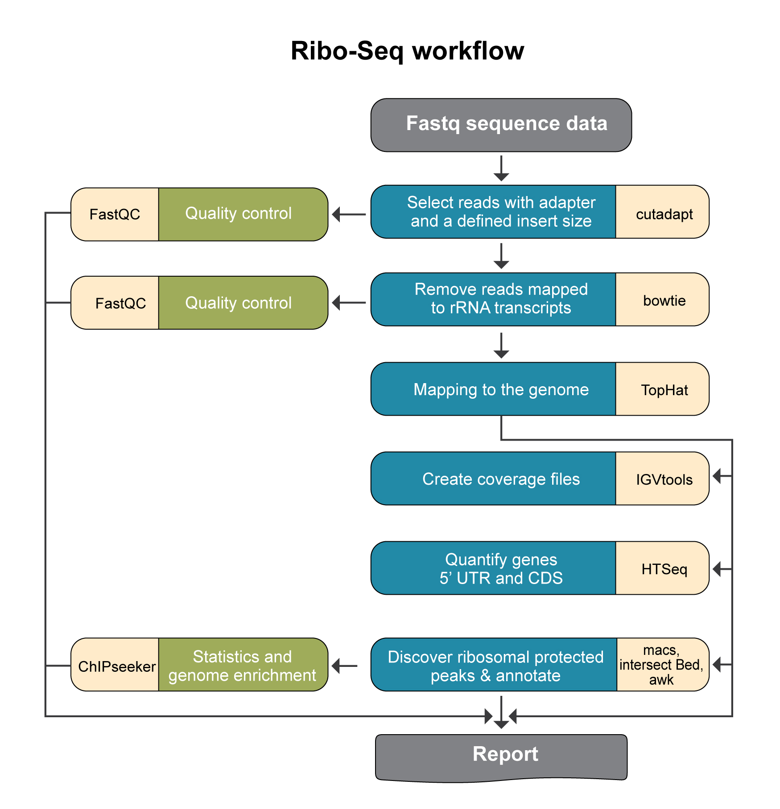

Ribo-seq pipeline steps and reports
###################################

Analysis pipeline steps
-----------------------

Initial steps are similar to described in Ingolia et al. Nature 2012 

1. Filtering Sequences:

  Cutadapt:
    Keep sequences 20-50 bp that have an adapter.
    Remove adapter and the first base.

2. Align to rRNA Transcripts:

  Bowtie:
    Align sequences to rRNA transcripts.
    Keep sequences that do not align.

3. Filtering for Reads of Length 28-33:

  Cutadapt:
    Filter reads to keep sequences of length 28-33 bp.

4. Align to Genome:

  Tophat:
    Align the filtered sequences to the genome.

5. Create Coverage Files:

  IGVTools:
    Create TDF files for coverage visualization.

6. Quantify 5'UTR and CDS:

  HTSeq:
    Quantify 5'UTR and CDS regions.

7. Discover Ribosomal Profiling Summits:

  MACS:
    Identify ribosomal profiling summits.
  IntersectBed & awk:
    Shift and expand summits.
    Annotate the summits.

Summarized points- 

1. Sequence data: Including file format conversion and/or demultiplexing
2. Filter sequences: keep sequences that have adapter and that after adapter remivl are atleast 20 bases long
2a. Run QC
4. Align to rRNA transcripts and filter sequences that align
5. Filter sequences to keep sequences between footprint length 24-35
5a. Run QC
6. Align cDNA to genome
6a. Make coverage files (tdf)
6b. Calculate coverage on 5'UTR and CDS
7. Find peaks summits
8. Extend and annotate summits

                                                                                                    
Pipeline report
---------------

Upon completion of the analysis, you will be sent an email with links to the results report.

The report includes several sections:

1. Sequencing and Mapping QC

    a. `**Figure 1** <https://dors4.weizmann.ac.il/utap/figures/ribo_fig_1.png>`_ - Plots the average quality of each base across all reads. Qualities of 30 (predicted error rate 1:1000) and above are good. 
    b. `**Figure 2** <https://dors4.weizmann.ac.il/utap/figures/ribo_fig_2.png>`_ - Histogram showing the number of reads for each sample in the raw data.
    c. **Figure 3** - Histogram showing the percentage of reads discarded after trimming the adapters (after removing adapters, short, polyA/T and low quality reads are discarded by the pipeline).
       No figure will be presented if the percentage of reads discarded after trimming for all samples is lower than 1%.
    d. `**Figure 4** <https://dors4.weizmann.ac.il/utap/figures/ribo_fig_4.png>`_ - Histogram with the number of reads for each sample in each step of the pipeline.

2. MACS peak calling
    a. `**Figure 5** <https://dors4.weizmann.ac.il/utap/figures/ribo_fig_5.png>`_ - MACS (peak calling) results table for each sample.
    b. `**Figure 6** <https://dors4.weizmann.ac.il/utap/figures/ribo_fig_6.png>`_ - Histogram with the number of peaks for all samples.
    c. `**Figure 7** <https://dors4.weizmann.ac.il/utap/figures/ribo_fig_7.png>`_ - Histogram showing Peaks distribution in genomic regions.    
    d. `**Figure 8** <https://dors4.weizmann.ac.il/utap/figures/ribo_fig_8.png>`_ - Histogram showing Peaks distribution around TSS.
    e. `**Figure 9** <https://dors4.weizmann.ac.il/utap/figures/ribo_fig_9.png>`_ - Venn diagram of peak overlaps among the first four comparisons.
                                                                                                      
3. `Bioinformatics Pipeline Methods <https://dors4.weizmann.ac.il/utap/figures/ribo_fig_10.png>`_ - description of pipeline methods

4. `Links to additional results <https://dors4.weizmann.ac.il/utap/figures/ribo_fig_11.png>`_ - links for downloading tables with raw, normalized counts, log normalized values (rld), and statistical data of contrasts.
                                                                                                   
--------------- 
                                                                                                      
                                                                                                      
Output folders
---------------                                                                                                      
                                                                                                      
1_cutadapt

2_fastqc

3_bowtie_rRNA

4_cutadapt_filter_length

5_fastqc

6_multiQC

7_tophat

8_samtools_filter

9_tdf

10_count_reads

11_merge_htseq_counts

12_macs_peaks

13_shif_and_extend_summit

14_reports

Log files (one directory above the output directory):

snakemake_stdout.txt

Add label

                                                                                                      
Annotation file
---------------

For Peak annotation, we use annotation files (gtf format) from "Ensembl" or "GENCODE". 
                                                                                                      
                                                                                                      

Examples of reports
-------------------

`Ribo-Seq example <https://utap-demo.weizmann.ac.il/reports/20241118_225323_demo/report_Chromatin_pipelines.html>`_

