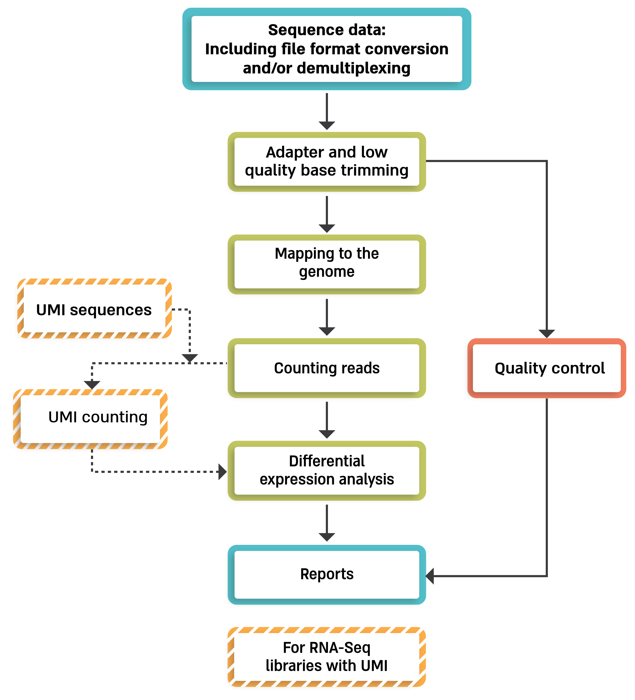

Analysis pipeline steps and reports
###################################

Analysis pipeline steps
-----------------------

1. Trims adapter sequences

2. Runs FastQC on the trimmed sequences for quality control of the samples, in parallel with the steps that follow

3. Maps reads to the selected reference genome

4. Adds UMI and gene information to the reads

5. Quantifies gene expression by counting reads

6. Counts UMI's for cases of PCR bias

7. Detects Differentially Expressed (DE) genes for a model with a single factor

Steps 3 and 5 are performed only for Mars-Seq

Step 6 is performed only if DESeq2 is selected

Pipeline report
---------------

Upon completion of the analysis, you will be sent an email with links to the results report.

The report includes several sections:

1. Sequencing and Mapping QC

    a. **Figure 1** - Plots the average quality of each base across all reads. Qualities of 30 (predicted error rate 1:1000) and above are good

    b. **Figure 2** - Histogram showing the number of reads for each sample in the raw data
    c. **Figure 3** - Histogram showing the percentage of reads discarded after trimming the adapters (after removing adapters, short, polyA/T and low quality reads are discarded by the pipeline)
    d. **Figure 4** - Histogram with the number of reads for each sample in each step of the pipeline
    e. **Figure 5** - Plots sequence coverage on and near gene regions (Not available in current version)
    f. **Figure 6** -
        i.  Histogram showing the percentage of mapped reads (both uniquely and not uniquely) per sample
        ii. Histogram showing the percentage of the uniquely mapped reads that mapped to genes (included genes must have at least 5 reads)
2. Exploratory Analysis
    a. **Figure 7** - Heatmap plotting the highly-expressed genes (above 5% of total expression). For example, the expression of gene RN45S in sample SRR3112243 constitutes 15% of the total expression
    b. **Figure 8** - Heatmap of Pearson correlation between samples according to gene expression values
    c. **Figure 9** - Clustering dendogram of the samples according to gene expression
    d. **Figure 10** - PCA analysis
        i. Histogram of % explained variability for each PC component
        ii. PCA plot of PC1 vs PC2
	iii. PCA plot of PC1 vs PC3

3. Differential Expression Analysis (this section exists only if you run the DESeq2 analysis) - a table with the number of differentially expressed genes (DE) in each category (up/down) for the different contrasts.  In addition, links for p-value distribution, volcano plots and heatmaps, as well as a table of the DE genes with dot plots of their expression values are also provided

4. Bioinformatics Pipeline Methods - description of pipeline methods

5. Links to additional results - links for downloading tables with raw, normalized counts, log normalized values (rld), and statistical data of contrasts. In cases of models with batches, "combat" values were calculated (instead of rld) using the "sva" package, providing batch corrected normalized log2 count values.

Annotation file
---------------

For counts of the reads per gene, we use annotation files (gtf format) from "Ensembl" or "GENCODE". In MARS-seq analysis, we extend the 3' UTR exon away from the transcript on the DNA and extend or cut the 3" UTR exon towards the 5' direction on the mRNA.

Examples of reports
-------------------

`RNA-Seq example <https://utap-demo.weizmann.ac.il/reports/20230613_081343_test/test_20230613_081343/report.html>`_

`Mars-seq example <https://utap-demo.weizmann.ac.il/reports/20230520_231819_test/test_umi_counts_20230520_231819/report.html>`_

Note: This example analysis demonstrates a good starting point, and not necessarily an end result.

