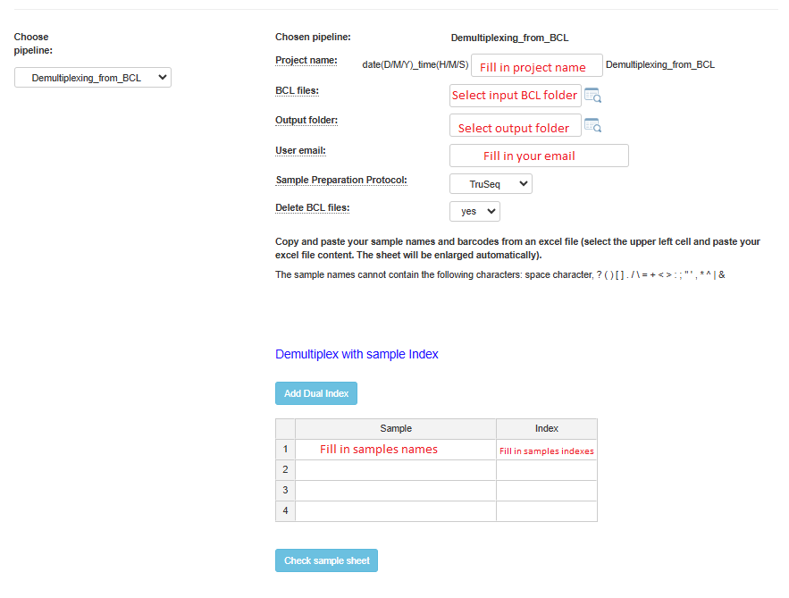
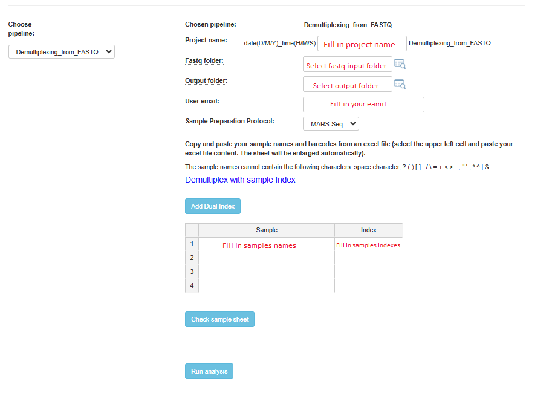

Run Demultiplexing pipeline
###########################

There are 2 pipelines for demultiplexing; the first accepts BCL files as input, the second fastq files.

Demultiplexing from BCL files
-----------------------------

Upload BCL files to the server according to the following instructions:

.. toctree::
    :maxdepth: 1

    upload

All original BCL file folders must be built according to Next-seq (or Hi-seq) machine requirements. Folder names should adhere to the template <date>_<machine name>_<run number>_<flowcell id>, e.g.  "170802_NB501465_0140_AH3W3KBGX3".

The pipeline converts bcl files to fastq files, and demultiplexes fastq files according to MAR-seq or True-seq (or semi- True-seq) or SCRB-seq protocols.

Demultiplexing from BCL Analysis Setup
======================================

Demultiplexing from fastq files
-------------------------------

The pipeline demultiplexes fastq files according to MAR-seq protocol.

Upload fastq files to the server according to the following instructions:

.. toctree::
    :maxdepth: 1

    upload

The input folder should contain the undetermined FASTQ files. Note: the pipeline can accept multiple files per read as input (i.e., multiple files for each R1 and R2, such as undetermined_fastq_files/Undetermined_S0_L001_R1_001.fastq.gz and Undetermined_S0_L002_R1_001.fastq.gz).
The pipeline demultiplexes fastq files according to MAR-seq protocol.

Demultiplexing from fastq Analysis Setup
======================================

For both pipelines, if you have dual indexes, click on the Add Dual Index button, and an additional index column will be added to the table.
After completing the addition of all sample names and indexes, it is highly recommended to verify that all names and indexes are valid by clicking on the Check Sample Sheet button.
