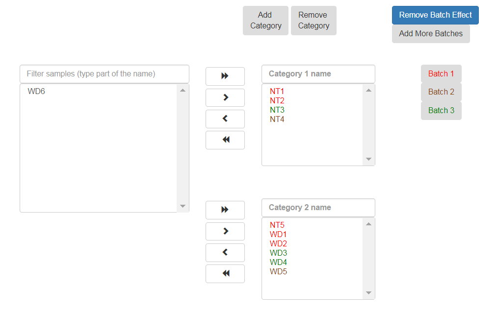

Run RNA-seq or MARS-seq pipeline
################################

The pipeline is designed to perform DESeq2 analysis on a raw counts matrix.

DESeq2 from counts matrix Analysis Setup
----------------------

.. image:: ../figures/deseq2_from_matrix.png

------------

In the input file field, navigate through your directory structure and use the Select button to choose the file containing the counts matrix for analysis. The file must be in either CSV or TXT format.

Tip: To move up one or more directory levels, click on the desired folder level in the path displayed at the top of the window.

.. image:: ../figures/browse-folder.png

If there is an issue with the selected file, resolve the error and retry by selecting the corrected file.

If you want the output folder to be different from the automatically populated one (based on the selected input folder), navigate and select your desired output folder.

Fill in the project name, then select Genomes for Functional Analysis.

------------

To identify what's differentially expressed by using the DESeq2 package, select the Run DESeq2 option. By default, two categories must be created. Fill in the category names for each of the 2 categories displayed by default. To define more categories, click on the Add Categories button to enable entering their details.

.. image:: ../figures/deseq1.png

------------

Choose the samples by first selecting them, and then using the arrows to move them to the appropriate categories. You may also add additional categories.

.. image:: ../figures/deseq2.png

------------

The order of what's being compared will be determined by the specification order of the categories. For example, DESeq2's output will show a "Treatment" vs "Control" comparison when "Treatment" is defined to be the first category, and "Control" the second.
Note that when submitting more than two categories, all categories will be compared with all the rest (e.g. for three categories - category 1 vs category 2, category 1 vs category 3, category 2 vs category 3).

If the samples were prepared in different batches, one can annotate them as follows: After moving the samples into category boxes, click on the "Add Batch Effect" button, select the samples from the category boxes that belong to a particular batch, and click on the "Batch 1" button. Repeat the operation for the other batches. Be sure that the batch effect is designed correctly - seeDESeq2 documentation `here  <https://bioconductor.org/packages/3.7/bioc/vignettes/DESeq2/inst/doc/DESeq2.html#model-matrix-not-full-rank>`_.

 DESeq2  will be run only on samples with categories.

Finally, click on the "Run analysis" button.

At the end of the run, an email will be sent reporting analysis completion.

Using the pipeline efficiently
------------------------------

**If you want re-run the DESeq2 step several times on the same input file (with other comparisons/batches), after completion of the initial analysis you will see (on the "user dataset" screen) a new button called "run again with other parameters". Clicking on this button will re-run the DESeq2 step.**
