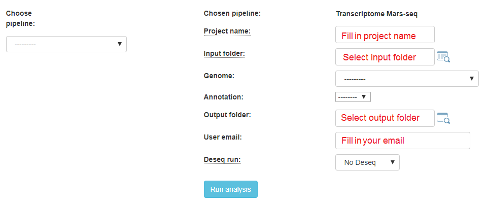
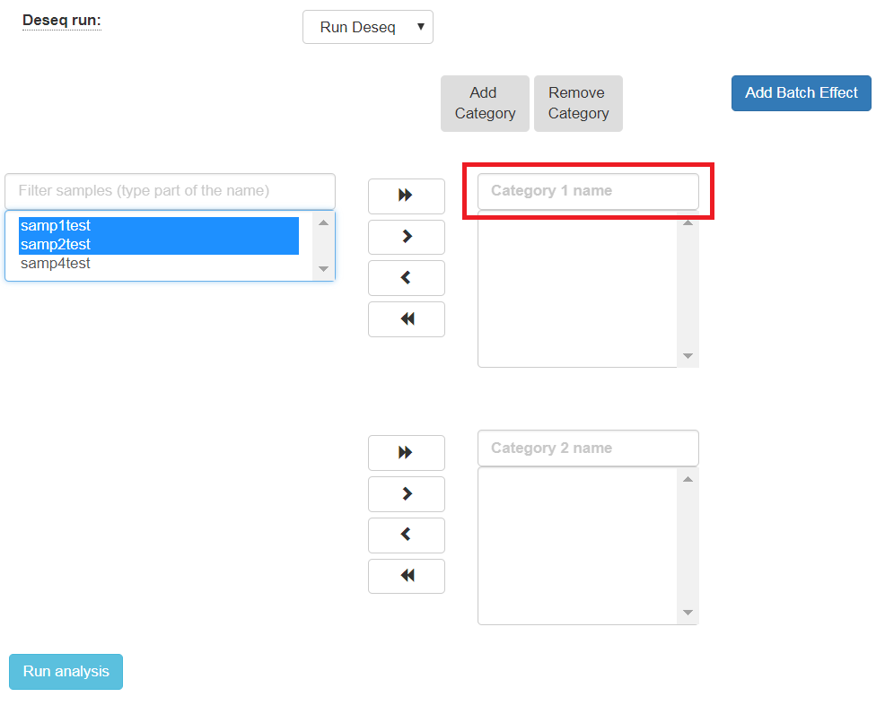

Run RNA-seq or MARS-seq pipeline
################################

RNA-seq Analysis Setup
----------------------
If your protocol is RNA-seq, you will get this screen:

If your protocol is MARS-seq, you will get this screen:

------------

In the input folder field, Browse within your directory structure and use the Select button the **root folder**  for analysis.  Note that if you wish to go up one level (or more) click on the desired folder level using the path at the top of the window.

.. image:: ../figures/browse-folder.png

Input folder names must conform to the correct format as previously described. If there is a problem with the folder you selected, first resolve the error and then retry, selecting the updated folder.

If you wish the output folder to be different from the one automatically filled in (based on the selected input folder), just select the desired output folder.

Fill in the project name, then select the genome and annotation.

For RNA-seq protocols, choose whether your protocol is stranded (sequenced reads save the original strand of RNA fragments) or non-stranded.

Define the type of your adapters for each read (R1 and R2). These adapters will be removed from the reads by the pipeline. You can leave the default adapters if you use True-seq protocol P5 and P7 adapters.

------------

To identify what's differentially expressed by using the DESeq2 package, select the Run Deseq option. By default, two categories must be created. Fill in the category names for each of the 2 categories shown. To define more categories, click on the Add Categories button to enable entering their details.

------------

Choose the samples by first selecting them, and then using the arrows to move them to the appropriate categories. You may also add additional categories.

.. image:: ../figures/deseq2.png

------------

The order of what's being compared will be determined by the specification order of the categories. For example, DESeq2's output will show a "Treatment" vs "Control" comparison when "Treatment" is defined to be the first category, and "Control" the second.

If the samples were prepared in different batches, one can annotate them as follows: After moving the samples into category boxes, click on the "Add Batch Effect" button, select the samples from the category boxes that belong to a particular batch, and click on the "Batch 1" button. Repeat the operation for the other batches. Be sure that the batch effect is designed correctly - seeDESeq2 documentation `here  <https://bioconductor.org/packages/3.7/bioc/vignettes/DESeq2/inst/doc/DESeq2.html#model-matrix-not-full-rank>`_.

.. image:: ../figures/deseq-batch.png

All of the steps of the pipeline (mapping, counts etc.) will be run on all of the samples, with the exception of Deseq which will be run only on samples with categories.

Finally, click on the "Run analysis" button.

At the end of the run, an email will be sent reporting analysis completion.

Using the pipeline efficiently
------------------------------

**If you want re-run only the Deseq step several times on the same input folder (with other comparisons/batches), after completion of the initial analysis you will see (on the "user dataset" screen) a new button called "run again with other parameters". Clicking on this button will re-run only the Deseq step.**

**Thus, the analysis will re-run only the short Dseq step (which takes a few minutes) and not re-run all of the time-consuming steps of the complete pipeline.**
