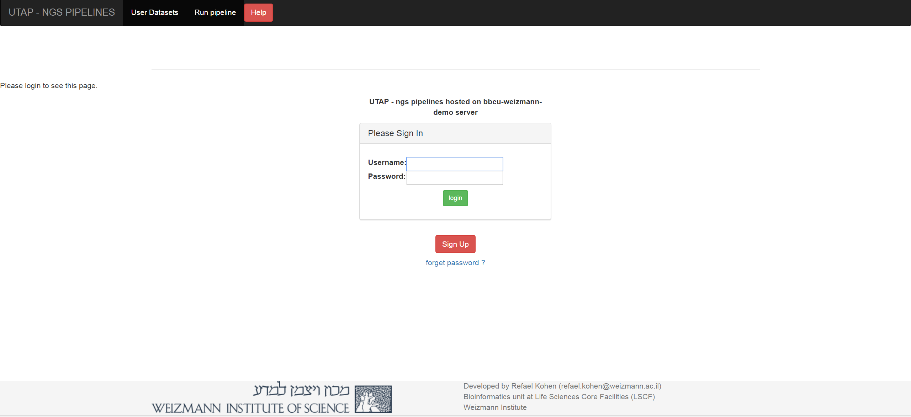
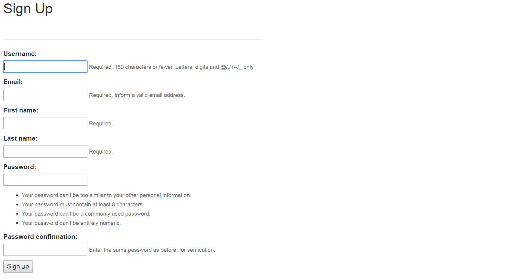
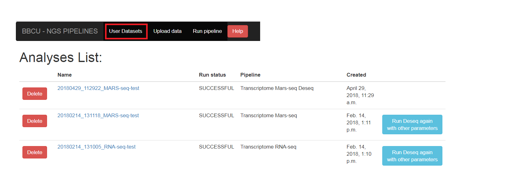
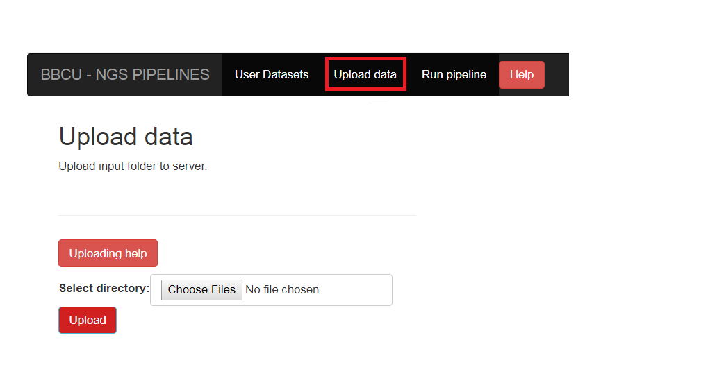
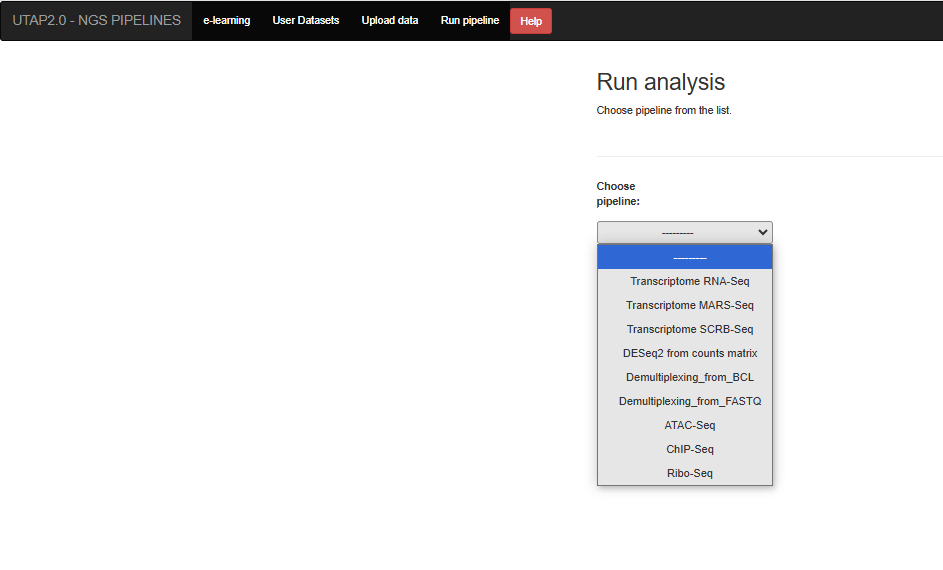

User guide
##########

Registration to the system
==========================

-------------

Click on the signup button and fill out the form:

User datasets
=============

The "User datasets" screen contains the list of the user's analyses. You can see the run status (RUNNING/SUCCESSFOL/FAILS). You need to refresh the page to see if the status has changed (you will also get an email at the end of the run).

Import Input data
=================

In order to run the transcriptome analysis pipeline, fastq sequence files need to be located on the server.

Click on the "Upload data" button on the navigation bar, and select the folder of the fastq files.

Run analysis
============

After importing you data (or if you have old data on the server that was imported in the past), you can run the pipeline by selecting the "Run pipeline" option

.. toctree::
    :maxdepth: 3

    Run peiplines 
    run-rna-mars-seq
    run-demultiplexing

Customization
=============

We chose the various pipeline parameters based on our rich experience in transcriptome analysis. This works very well for users who are not deeply familiar with bioinformatics software, and who prefer to quickly benefit from these choices without having to delve into the pipeline's architecture. On the other hand, many research groups have their own particular preferences, and can achieve flexibility by making some minor adjustments to the code as follows:
 
1. **System-wide changes:** 

   The Snakefiles of the pipelines are built using the Snakemake workflow management system (https://snakemake.readthedocs.io) , and are located at:

   $CONDA/envs/utap/lib/python2.7/site-packages/ngs-snakemake/snakefile-marseq.txt
   $CONDA/envs/utap/lib/python2.7/site-packages/ngs-snakemake/snakefile-rnaseq.txt

   (where $CONDA is the location of the miniconda -  see https://utap.readthedocs.io/en/latest/rst/installation.html).

   Users can modify the above scripts by adding new rules, commands and changing parameters. 

   In addition, one can customize the following R script's DESeq2 analyses and report generation:
   
   $CONDA/envs/utap/lib/python2.7/site-packages/ngs-snakemake/reports.Rmd

   After the code is changed, subsequent analyses using the web application will reflect these changes.   
2. **Ad-hoc changes:**
 
   Another option is to change parameters only for a particular run. 
    
   After running the analysis in the usual way, one can navigate to the output folder, which contains a copy of the snakefile and Rmd script. One can then change and re-run the analysis from the linux terminal by executing:  
    
   ``./snakemake_cmd_RUN_ID`` (where an example of a  RUN_ID is a timestamp like  "20171205_145424").

